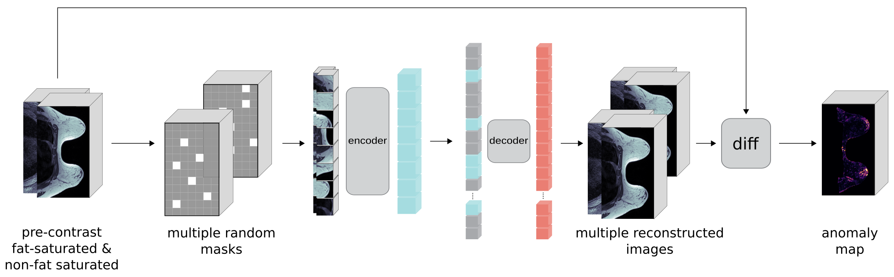

# 3D Masked Autoencoders with Application to Anomaly Detection in Non-Contrast Enhanced Breast MRI 

Code for your breast cancer anomaly detection [paper](https://arxiv.org/abs/2303.05861).

*  `utils/` contains all the files to download the data and prepare patches
*  `training/` involves the developed 3D masked autoencoder model and trainig scripts
*  `inference/` holds files to generate anomaly maps and subtraction images 
